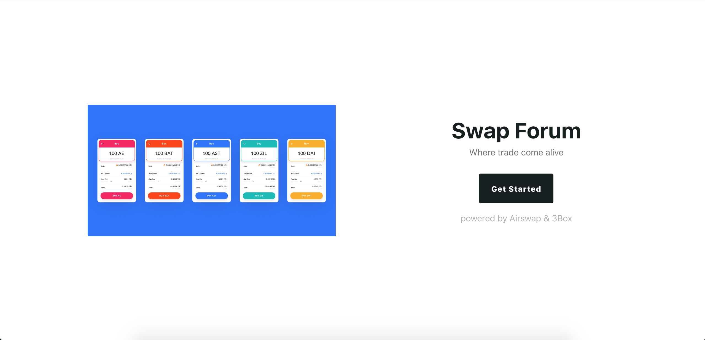
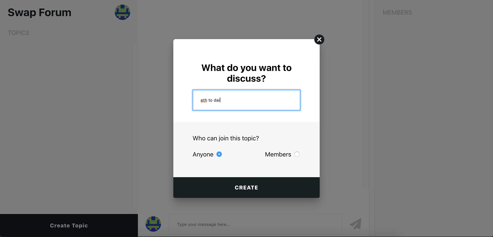
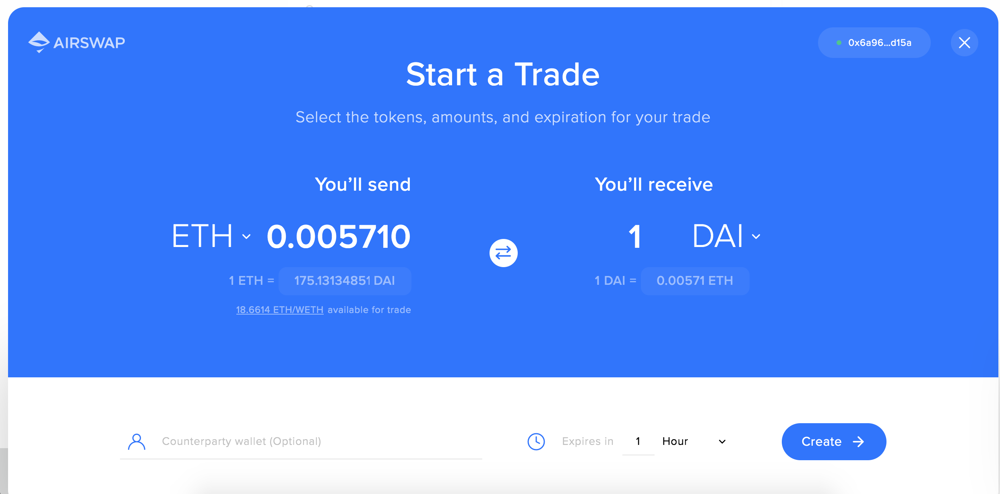
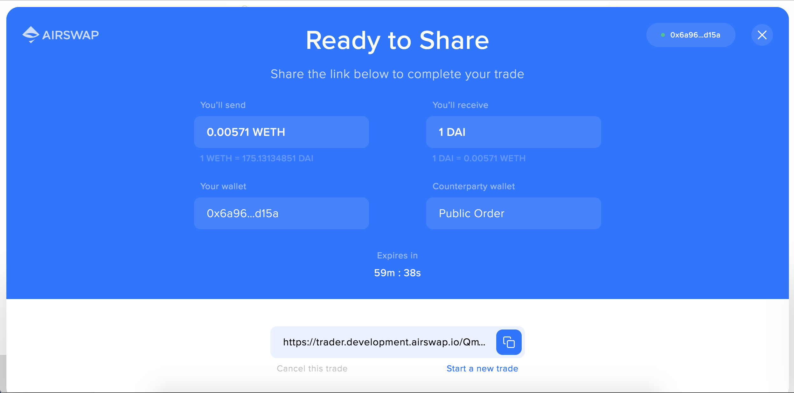
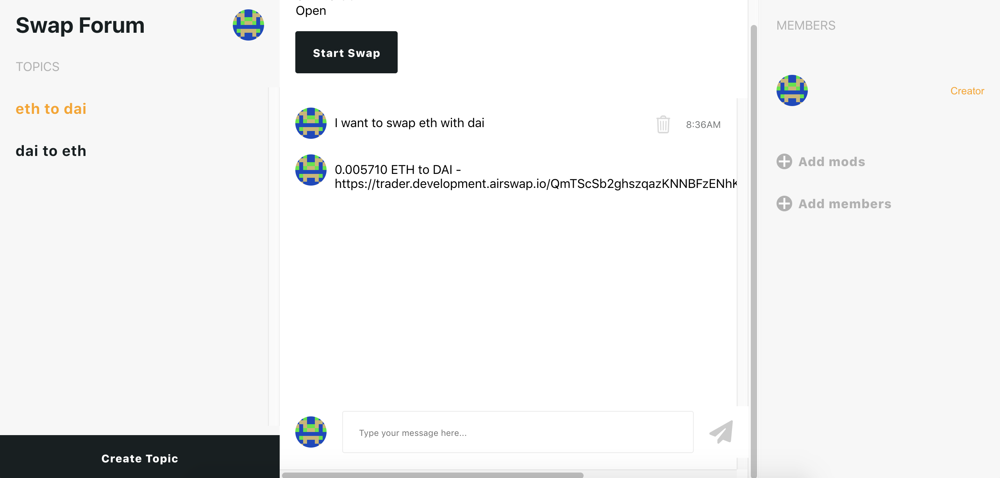
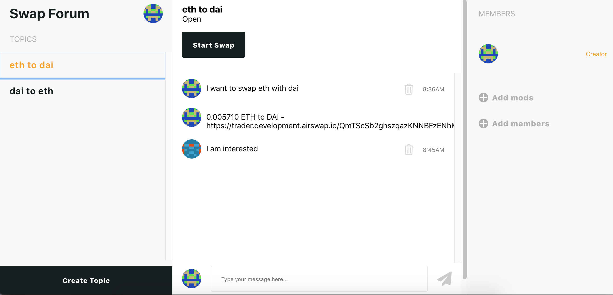

## Swap Forum
Where trade comes alive

## Demo Link
https://swapforum.netlify.com/ (Rinkeby)

## Screenshots

### Login


### Create Topic


### Airswap (Start Trade)


### Airswap (Trade Link)


### Forum Chat


### Forum Chat


## Getting Started

1) Clone Repo

    ```
    git clone https://github.com/viraja1/swap_forum.git
    ```
    
2) Change directory
    
   ```
   cd swap_forum
   ```

3) Build client app

    ```
    npm install
    ```
    
4) Start client app

    ```
    npm start
    ```
    
5) Open client app url in chrome

    ```
    http://localhost:3000
    ```
    
6) Install Metamask chrome extension

    ```
    https://chrome.google.com/webstore/detail/metamask/nkbihfbeogaeaoehlefnkodbefgpgknn?hl=en
    ```
    
7) Create account in metamask
     
8) Test the App

    Make sure that you have selected the right network using 
    metamask (Rinkeby). 